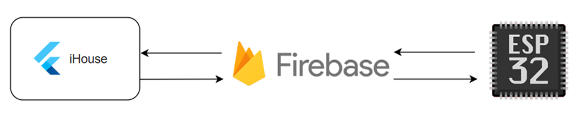

# iHouse

iHouse: A smart home management app that enables users to control and monitor IoT devices
seamlessly.
With an intuitive interface and robust backend, iHouse offers features like real-time device status
updates, remote control, and automation for a smarter living experience.

## Getting Started

The IoT system of the project is designed based on three main components:
- Front-end: Flutter
- Back-end: Firebase
- Hardware: ESP32

The main technologies used in this project include:
- Firebase: Realtime Database, Cloud Firestore, FCM, Authentication, etc.
- Integration with the Gemini API.
- Hardware: ESP32 along with electronic devices and IoT sensors.

